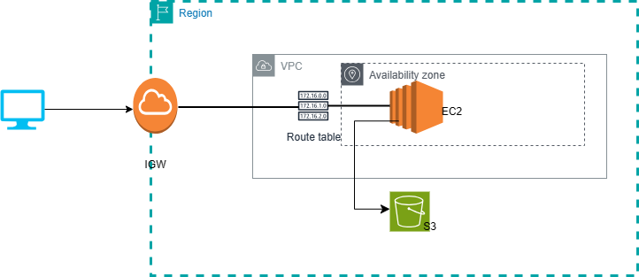

# AWS HTML Website Deployment

This repository contains scripts and instructions for deploying an HTML website on a single EC2 instance, with web files stored in an S3 bucket.

## Architecture



- **S3 Bucket:**
  - Log in to the AWS Management Console.
  - Navigate to the S3 service.
  - Create a new S3 bucket and upload HTML files, CSS, JavaScript, images, etc.
  - Ensure public read access by updating the bucket policy.

- **EC2 Instance:**
  - Launch a new EC2 instance using an Amazon Linux 2 AMI or a suitable AMI.
  - Use the default VPC/SUBNET.
  - Enable the public IP for the instance.
  - Configure the security group to allow inbound traffic on port 80 (HTTP).

- **User Data Script:**
  - The EC2 instance is configured using the following user data script during launch:
    ```bash
    #!/bin/bash

    sudo su
    yum update -y
    yum install -y httpd
    cd /var/www/html
    wget  https://s3.amazonaws.com/myaws.bucket456/mole.zip
    unzip mole.zip
    cp -r mole-main/* /var/www/html/
    rm -rf mole.zip
    systemctl enable httpd
    systemctl start httpd
    ```
  .

## How to Use

1. **S3 Bucket Setup:**
   - Log in to the AWS Management Console.
   - Navigate to the S3 service.
   - Create a new S3 bucket.
   - Upload your website files.

2. **EC2 Instance Setup:**
   - Launch a new EC2 instance following the provided instructions.
   - Use the default VPC/SUBNET.
   - Enable public IP and configure the security group.

3. **User Data Script:**
   - Insert the provided user data script during EC2 instance launch.

4. **Access the Website:**
   - Once the instance is running, access your website using the public IP address of the EC2 instance.

## Notes

- Ensure proper AWS credentials are set up for the user deploying the resources.
- Review and adjust security settings based on your specific requirements.
- For increased security, consider using AWS Identity and Access Management (IAM) roles and fine-grained S3 bucket policies.

Feel free to customize the instructions and diagram according to your specific needs.
